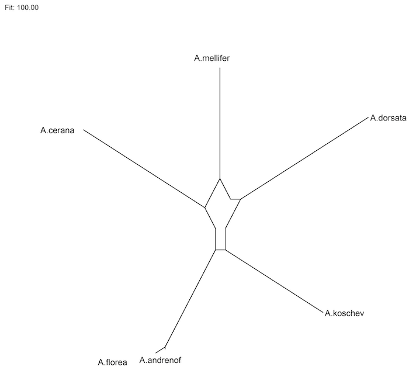
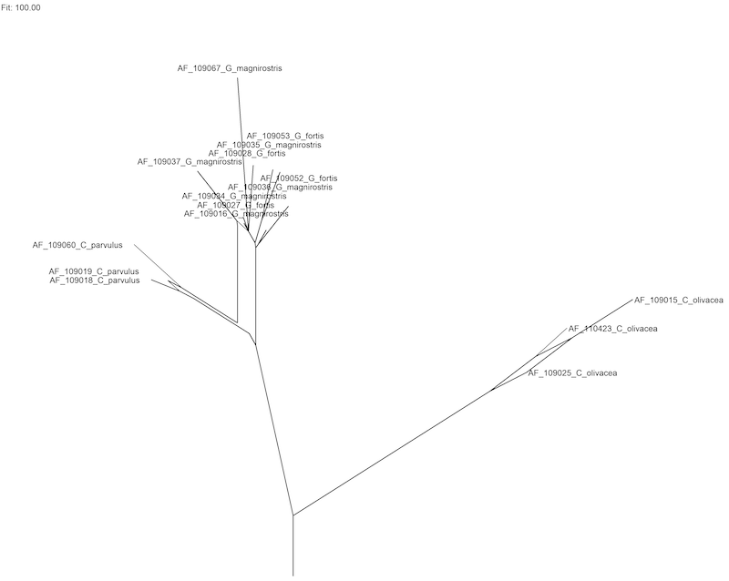

# SplitsPy

## Overview

This package provides a program called outline.py that provides an implementation of phylogenetic outlines. In more detail, it implements two algorithms:

1) The neighbor-net algorithm (Bryant and Moulton, 2004) is used to produce a circular ordering of taxa and a set of circular splits.

2) The outline algorithm is then used to compute a phylogenetic outline (Huson et al, 2021), from the output of the neighbor-net algorithm.

The program uses [Pillow](https://github.com/python-pillow/Pillow) to render the phylogenetic outline.

## Installation:

Download source files from GitHub or use pip:

        pip install SplitsPy

## Usage:

Usage:
     
    outline [options] infile

Runs neighbor-net and computes a phylogenetic outline

Options:

    -h, --help           show this help message and exit
    -o FILE, --output=FILE
                         output image file
    -n FILE, --nexus=FILE
                        output splits file (Nexus format for SplitsTree5)
    -t FILE, --tgf=FILE output graph file (in trivial graph format)

    Outline Options:
    -r, --rooted        rooted network
    -a, --alt           alternative layout for rooted network
    -g GRP, --out_grp=GRP
                        out-group taxa for rooted network (format:
                        tax1,tax2,...)

    Window Options:
    --width=WIDTH       window width
    --height=HEIGHT     window height
    --m_left=MARGIN     left margin
    --m_right=MARGIN    right margin
    --m_top=MARGIN      top margin
    --m_bot=MARGIN      bottom margin
    --font_size=SIZE    font size
    
## Input format:

The program expects to read a distance matrix from input, either from the named input file, or from  standard in, if '-' is supplied as input name.
The format is as follows:

    6
    A.andrenof  0 0.090103 0.103397 0.096012 0.004431 0.075332
    A.mellifer  0.090103 0 0.093058 0.090103 0.093058 0.100443
    A.dorsata   0.103397 0.093058 0 0.116691 0.106352 0.103397
    A.cerana    0.096012 0.090103 0.116691 0 0.098966 0.09896
    A.florea    0.004431 0.093058 0.106352 0.098966 0 0.078287
    A.koschev   0.075332 0.100443 0.103397 0.098966 0.078287 0

## Output:

The program runs the neighbor-net algorithm and then computes and displays the corresponding phylogenetic outline:

## Rooted outlines:

The program can also compute a rooted outline. The option -r activates mid-point rooting. If an out-group is given, then the program will attempt to place the root between the out-group taxa and all other taxa:

## Contributions:

The neighbor-net algorithm is due to David J. Bryant and Vincent Moulton (2004). It was originally implemented in Matlab by David Bryant. David Bryant and Daniel Huson ported the code to Java (Huson and Bryant, 2006) and to Python (Huson et al, 2021). Phylogenetic outlines and the outline algorithm are due to David Bryant and Daniel Huson, and were implemented by Daniel Huson in Java and Python (Huson et al, 2021).

## References:

- Daniel H. Huson, Caner Bagci, Banu Cetinkaya and David Bryant. Phylogenetic context and the use of phylogenetic outlines. Manuscript in preparation (2021)
- [Daniel H. Huson and David Bryant (2006). Application of Phylogenetic Networks in Evolutionary Studies. Mol Biol Evol 23(2):254–267](https://academic.oup.com/mbe/article/23/2/254/1118872)- [David Bryant and Vincent Moulton (2004). Neighbor-net: an agglomerative method for the construction of phylogenetic networks. Mol Biol Evol. 21(2):255-265.](https://academic.oup.com/mbe/article/21/2/255/1187993)

