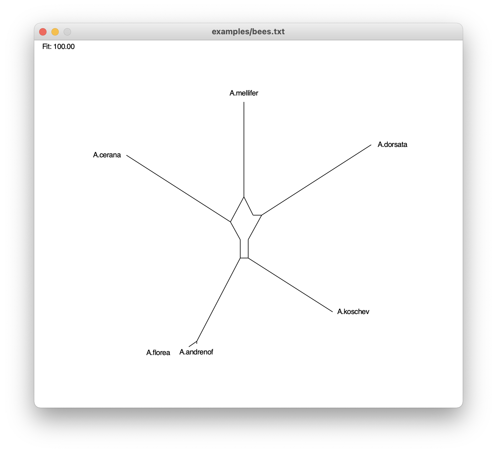

# SplitsPy

## Overview

This package provides a program called outline.py, which implements two algorithms:

1) The neighbor-net algorithm (Bryant and Moulton, 2004) is used to produce a circular ordering of taxa and a set of circular splits.

2) The outline algorithm is then used to compute a phylogenetic outline (Huson et al, 2021), from the output of the neighbor-net algorithm.

The program then displays a drawing of the phylogenetic outline (using John Zelle's graphics.py library).

## Usage:

Usage: outline.py [options] infile

Run neighbor-net and compute a phylogenetic outline

Options:
  -h, --help            show this help message and exit
  -o FILE, --output=FILE
                        Output file. Save splits in nexus format (for use with SplitsTree5)
  -n, --no_draw         Do not draw the network

  Outline Options:
    -r, --rooted        Rooted network
    -a, --alt           Alternative layout rooted network
    -g GRP, --ogroup=GRP
                        Out-group taxa for rooted network (format:
                        tax1,tax2,...)

  Window Options:
    --width=WIDTH       Window width
    --height=HEIGHT     Window height
    --margin_left=ML    Left margin
    --margin_right=MR   Right margin
    --margin_top=MT     Top margin
    --margin_bot=MB     Bottom margin
    --font_size=F_SIZE  Font size
    
## Input format:

The program expects to read a distance matrix from input, either from the named input file, or from  standard in, if '-' is supplied as input name.
The format is as follows:

6 
A.andrenof  0 0.090103 0.103397 0.096012 0.004431 0.075332 
A.mellifer  0.090103 0 0.093058 0.090103 0.093058 0.100443 
A.dorsata   0.103397 0.093058 0 0.116691 0.106352 0.103397 
A.cerana    0.096012 0.090103 0.116691 0 0.098966 0.09896 
A.florea    0.004431 0.093058 0.106352 0.098966 0 0.078287 
A.koschev   0.075332 0.100443 0.103397 0.098966 0.078287 0 

## Output:

The program computes and displays the corresponding phylogenetic outline:

## Contributions:

The neighbor-net algorithm is due to David J. Bryant and Vincent Moulton (2004). It was originally implemented in Matlab by David Bryant. David Bryant and Daniel Huson ported the code to Java (Huson and Bryant, 2006) and to Python (Huson et al, 2021). Phylogenetic outlines and the outline algorithm are due to David Bryant and Daniel Huson, and were implemented by Daniel Huson in Java and Python (Huson et al, 2021.

